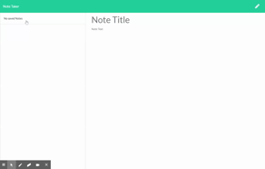

# Homework_11_Express.Js_Note_Taker
# Note Taker

## Table of Contents 
- [Description](#description) 
- [Installation](#installation) 
- [Usage](#usage)
- [Testing](#testing)
- [Contribute](#contribute)
- [Credits](#credits) 
- [License](#license) 
- [Questions](#questions) 

## Description

This app can be used to write, save and delete notes.  This application was built using Express.js backend and will save and retrieve note data from JSON file.  This application is also deployed on Heroku, found [here](https://sleepy-journey-41995.herokuapp.com/notes)

This project may have some requeriments you need to meet in order to compile it. 
You may need NodeJS in order to run javascript on the console and install dependecnies. You can go to the NodeJS site and follow trough the installation process.  After you get the node command on the console, you will have the node package manager npm as well. Please read the package instruction section below.

## Installation:
These instructions will get you a copy of the project up and running on your local machine for development and testing purposes. 

This project uses express.js for the backend.  Use npm to install dependencies.

## Usage:
This repository is used to take, save, and delete notes.

In order to start using the project you need to clone it to your computer. Or you can download the the zip version.
After you have it on you pc, you need to go in the console to the project folder and execute the following command to gather all the dependencies.

> npm install

## Testing:
No testing.

## Contributing: 
This project used starter code provided by Trilogy Education.

To contribute to < strong > Big Bad Readme generator < /strong>, follow these steps:

Create a branch:
>git checkout - b <branch_name>

Make your changes and commit them:
>git commit - m '<commit_message>'

Push to the original branch:
>git push origin <project_name>/<location>

Create the pull request. Alternatively see the GitHub documentation on creating a pull request.

## Credits:
Repo owner takes credit, and credit goes to the great instructors at the uPenn Coding Bootcamp.
## License:
This project uses the following license: 

https://opensource.org/licenses/Apache-2.0

Copyright 2020 mikeMarino

Licensed under the Apache License, Version 2.0 (the "License");
you may not use this file except in compliance with the License.
You may obtain a copy of the License at

http://www.apache.org/licenses/LICENSE-2.0

Unless required by applicable law or agreed to in writing, software
distributed under the License is distributed on an "AS IS" BASIS,
WITHOUT WARRANTIES OR CONDITIONS OF ANY KIND, either express or implied.
See the License for the specific language governing permissions and
limitations under the License.
## Questions:
For all questions about this project, please email marino1820@gmail.com

Copyright(c) 2021 mikeMarino

